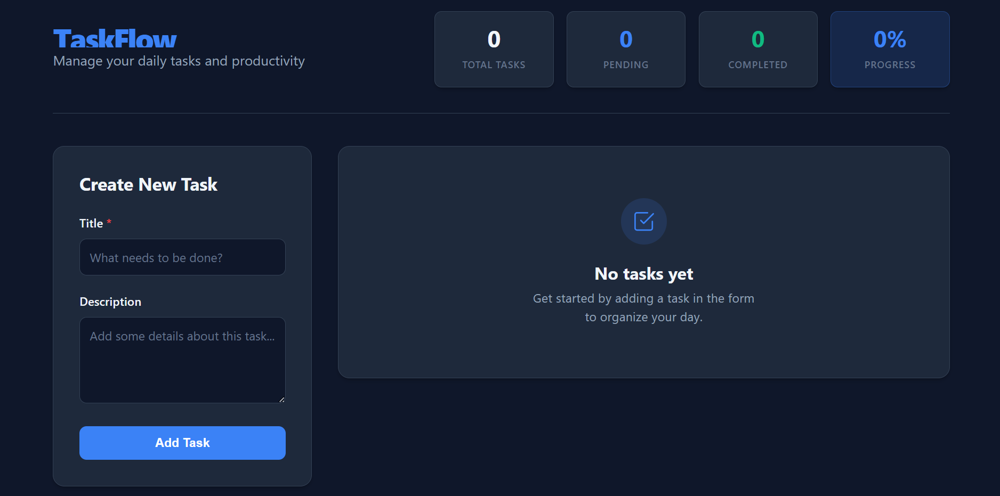
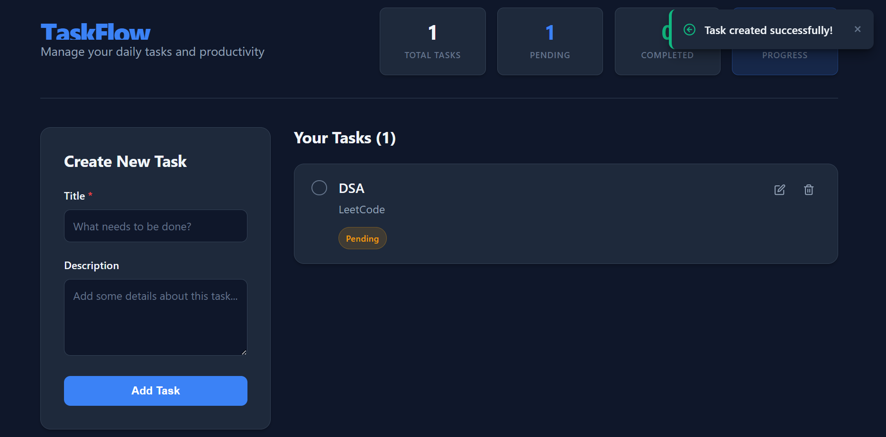
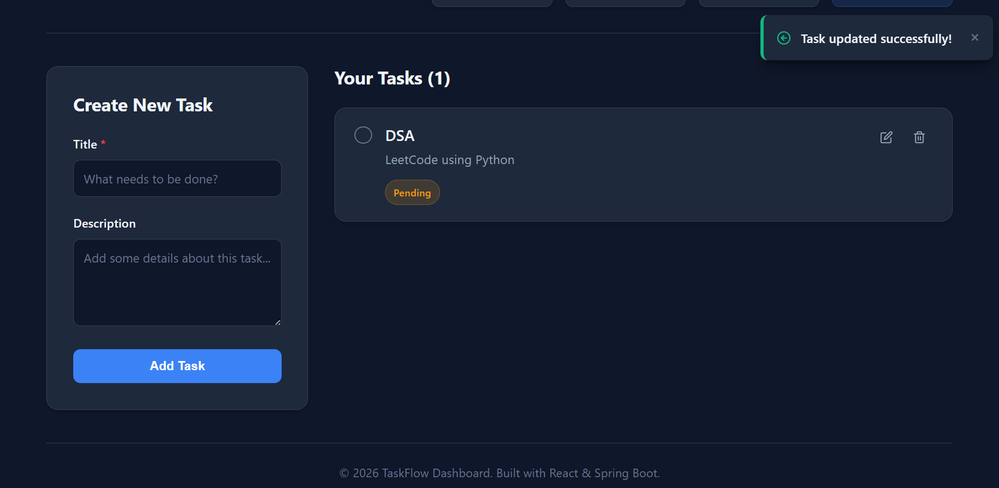
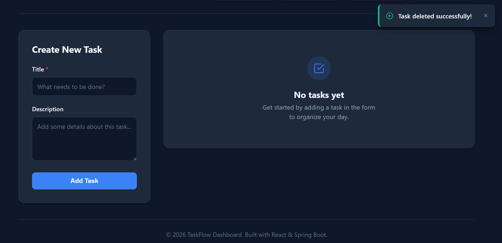

# 📋 Task Management System

A full-stack Task Management System built using **React**, **Spring Boot**, and **MySQL**. This application allows users to create, view, update, and delete tasks through a clean and responsive web interface.

---

## 🚀 Features

- ✅ Create new tasks
- 📄 View all tasks
- ✏️ Edit existing tasks
- 🗑️ Delete tasks
- 🔄 Automatic refresh after CRUD operations
- 📊 Dashboard statistics
- 📱 Responsive design
- 🌙 Light/Dark mode support
- ⚡ RESTful API integration

---

## 🛠️ Tech Stack

### Frontend
- React (Vite)
- Axios
- CSS3
- JavaScript (ES6)

### Backend
- Java 24
- Spring Boot
- Spring Data JPA
- Maven

### Database
- MySQL

### Tools
- VS Code
- Postman
- MySQL Workbench
- Git & GitHub

---

## 📂 Project Structure

```
TaskManagementSystem
│
├── backend
│   ├── controller
│   ├── entity
│   ├── repository
│   ├── service
│   └── resources
│
├── frontend
│   ├── components
│   ├── services
│   ├── App.jsx
│   └── App.css
│
└── README.md
```

---

## 📌 REST API Endpoints

| Method | Endpoint | Description |
|---------|----------|-------------|
| GET | `/api/tasks` | Get all tasks |
| GET | `/api/tasks/{id}` | Get task by ID |
| POST | `/api/tasks` | Create a new task |
| PUT | `/api/tasks/{id}` | Update a task |
| DELETE | `/api/tasks/{id}` | Delete a task |

---

## 🗄️ Database

Database Name:

```
taskmanager
```

Entity:

| Field | Type |
|-------|------|
| id | Long |
| title | String |
| description | String |
| status | String |

---

## ⚙️ Installation

### 1. Clone the repository

```bash
git clone https://github.com/AaliyaPatel-11/TaskManagementSystem.git
```

### 2. Backend

```bash
cd backend
```

Configure `application.properties`:

```properties
spring.datasource.url=jdbc:mysql://localhost:3306/taskmanager
spring.datasource.username=root
spring.datasource.password=YOUR_PASSWORD

spring.jpa.hibernate.ddl-auto=update
```

Run:

```bash
./mvnw spring-boot:run
```

---

### 3. Frontend

```bash
cd frontend
npm install
npm install axios
npm run dev
```

Open:

```
http://localhost:5173
```

---

## 📷 Screenshots

### Dashboard



### Add Task



### Edit Task



### Delete Task



---

## 🎯 Future Enhancements

- Task search
- Task filtering
- Due dates
- Priority levels
- User authentication
- Categories
- Pagination
- Email reminders

---

## 👩‍💻 Author

**Aaliya Mubashira**

GitHub: https://github.com/AaliyaPatel-11

LinkedIn: https://linkedin.com/in/patel-aaliya-mubashira-904293223/

---

## 📜 License

This project is created for educational and learning purposes.
